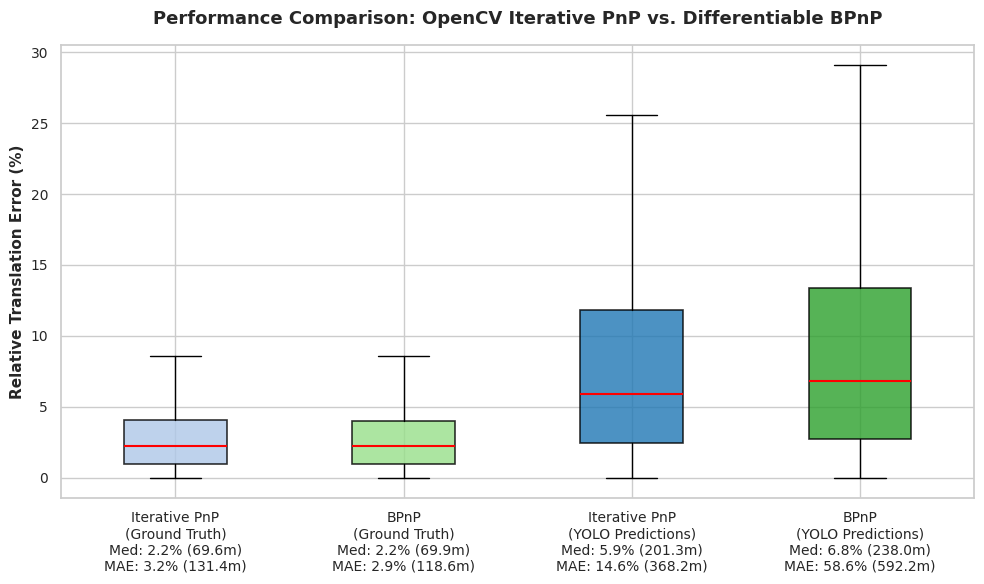

## Introduction


## Equation Writing Example
$$s \begin{bmatrix} u \\ v \\ 1 \end{bmatrix} = K \begin{bmatrix} R & t \end{bmatrix} \begin{bmatrix} X \\ Y \\ Z \\ 1 \end{bmatrix}$$

## Code Writing Example
```python
import cv2
import numpy as np

# Pose Estimation with OpenCV
success, rvec, tvec = cv2.solvePnP(object_points, image_points, camera_matrix, dist_coeffs)
```

## Image Showing example
To insert an image, stored in `assets/images/`, write : 
``` write : ```



test
